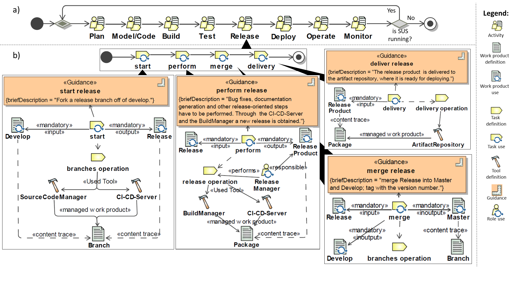

## DevOpsML
DevOpsML is a parent project that comprises the three subproject, PlatformMM, LinkingMM and Spem2.

In the **spem2 subproject**, in the folder *model*, there is the *spem2Complete.ecore* generated via UML editor from CMOF files provided by OMG. In the subproject folder *spemmodels* there are examples of DevOps processes conforming to *spem2Complete.ecore*. \
The ecore models in *spemmodels/deopsprocess/devopsprocess.model* and in *spemmodels/giflowrelease/releaseprocess.model* are represented in the figure below.

These same models can be found in the Magic Draw file *docs/magicdraw/ReleaseProcessmdzip*

In the **platformmm subproject**, in the folder *model*, there is the metamodel for DevOps platforms: *platformmm.ecore*. In the subproject folder *platformmmmodels* there are examples of libraries 'Tools and Interfaces', folder *tiLib*,  and 'Capabilities and Concerns', folder *ccLib*. In the same folder there is the *myPlat.model*, that is the representation of the platform obtained connecting the models in the libraries *tiLib* and *ccLib*. This model is represented in the *Platform Model* section of the object diagram below.

In the  **linkingmm subproject**, in the folder *model*, there is the linking metamodel *linkingmm.ecore*. With this metamodel it is possible to link elements of the spem2 process(es) between them or with the platform elements. It is also possible to link platform's elements between them.\
In the subproject folder *modelink*, the example *ReleaseProcMyPlatLink.model* links elements from the spem2 process modeled in *spemmodels/giflowrelease/releaseprocess.model* to elements from the platform represented in *platformmm/platformmmmodels/myPlat.model*.

The following object diagram shows the links of *ReleaseProcMyPlatLink.model*, that are set among multiple tools (Git, Maven, Jenkins, Nexus) from the platform model represented by *myPlat.model*, and SPEM tool definitions represented on *releaseprocess.model*.

