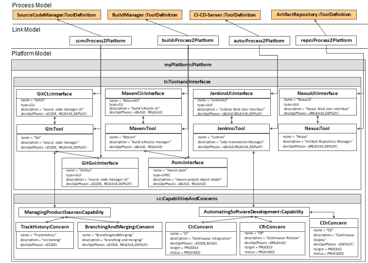

## DevOpsML
DevOpsML is a parent project that comprises the three subproject, PlatformMM, LinkingMM and Spem2.

The **spem2 subproject** has the *spem2Complete.ecore* generated via UML editor from CMOF files provided by OMG. In the subproject folder *spemmodels* there are examples of DevOps processes conforming to *spem2Complete.ecore*. 

In the **platformmm subproject** there is the metamodel for DevOps platforms. In the subproject folder *platformmmmodels* there are examples of libraries 'Tools and Interfaces', folder *tiLib*,  and 'Capabilities and Concerns', folder *ccLib*. In the same folder there is the *myPlat.model*, that is the representation of the platform obtained connecting the models in the libraries *tiLib* and *ccLib*.

In the  **linkingmm subproject** there is the linking metamodel. With this metamodel it is possible to link elements of the spem2 process(es) between them or with the platform elements. It is also possible to link platform's elements between them.\
In the subproject folder *modelink*, the example *myPlatLinking.model* links elements from the spem2 process modeled in *spem2/spemmodels/giflowreleas/gitflowrelease.model* to elements from the platform represented in *platformmm/platformmmmodels/myPlat.model*.

The following picture shows the links of *myPlatLinking.model* that are set among multiple tools (Git, Maven, Jenkins, Nexus) from the platform model represented by *myPlat.model* and SPEM tool definitions represented on *gitflowrelease.model*.

